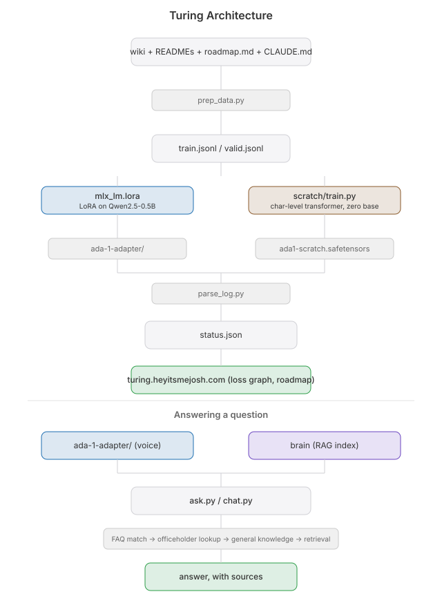

# Turing

[](https://github.com/nulljosh/turing/releases)
[](https://github.com/nulljosh/turing/actions/workflows/test.yml)
 [](https://github.com/nulljosh/turing)

-lightgrey)
[](https://github.com/nulljosh/turing)
[](https://github.com/nulljosh/turing/commits/main)

Building small language models in the open. First model: **Samantha**.

Live status page: [turing.heyitsmejosh.com](https://turing.heyitsmejosh.com)

**Turing vs. Samantha:** Turing is the project, the pipeline, the repo, this whole effort. Samantha is a model Turing produces. Same relationship as Anthropic and Claude (or a Claude model like Haiku/Fable): the project name is fixed, model names change as new ones ship. Each future model gets its own name too, not "Samantha-2".


## Why

Tried this before under the name Arthur, trained a model from scratch and it spat out gibberish after a few days. Wrong approach: from-scratch pretraining needs gigabytes of clean text and a lot of compute to stop being noise. Restarted as Turing with a different plan.

## What Samantha is

A LoRA fine-tune of `Qwen2.5-0.5B-Instruct-4bit` (small enough to train on-device on an M4), trained mostly on this project's own docs (not the whole fleet, see `prep_data.py`), chat-formatted so training actually matches how it's queried at inference.

Samantha's base model *is* Qwen2.5-0.5B, LoRA only adds a small trained delta on top of it. So "beat Qwen" isn't a fair or coherent bar, a LoRA fine-tune of Qwen can't outperform Qwen in general, only on the narrow thing it was fine-tuned for. The real benchmark is whether the fine-tuned version answers our own questions better than stock Qwen does. See `eval/` for that.

## Results

| Metric | Before | Now |
|--------|--------|-----|
| Tools | 0 | 13 |
| Actions eval | - | 54/54 |
| Knowledge sweep | 47/65 | 57/65 |
| Confidently wrong | 18 | 4 |
| Multistep latency | minutes (8B) | 5.3s |
| Model memory | 7.6GB | 3.5GB |
| Docs coverage | - | 36% |

## What she can do

She could answer. She could not do anything. Before 2026-09-20, "open chrome and go to hacker news" got an honest refusal:

```
You: open chrome and go to hacker news
Samantha: I couldn't find anything on that, and it's outside what I know about this project, so I'm not going to make something up.
```

Now she has hands.

```
You: open chrome and go to github.com
Samantha: Opened https://github.com in Chrome.

You: poke around hacker news and tell me the top 3 stories
Samantha: [read_page(https://news.ycombinator.com)] (the three real front page stories with their points, in 5.3 seconds)

You: open pixelmator then tell me my battery status
Samantha: [open_app(Pixelmator)] [battery()] The Mac is currently drawing power from the AC outlet.

You: who invented the telephone
Samantha: The telephone was invented by Alexander Graham Bell.

You: make me a logo for Turing, the most complex intricate logo ever
Samantha: I went with letters T, palette ember, rings 4, rays 12, ray_style dots, orbit_dots 8, star_points 4. 28 layers, built in Pixelmator.
```


How it works: a regex router handles plain commands with no model at all. Multi-step asks go to qwen3:1.7b through Ollama tool calling. The harness fetches pages before the model speaks so it cannot invent them. For logos she picks the dials and the harness does the layout. No shell tool, every tool is fixed argv.

Samantha is 0.5B and cannot pick tools herself yet. She borrows a 1.7B head for her hands. Training her own is the open roadmap item.

13 tools: open_app, open_url, web_search, current_tab, read_page, screenshot, clipboard, set_volume, battery, say, list_dir, read_file, make_logo.

Scores: actions eval 54/54, knowledge sweep 47/65 before the article reader.

## Pipeline

```
prep_data.py    -> data/train.jsonl, data/valid.jsonl   (own docs oversampled, fleet capped, chat-formatted)
mlx_lm.lora     -> ada-1-adapter/                        (LoRA weights)
parse_log.py    -> status.json                           (loss history for the landing page)
```

## Architecture



Includes the parallel from-scratch path under `scratch/`, a genuine zero-borrowed-weights character-level transformer, deliberately tiny and not meant to be fluent.

## Training

```
./.venv/bin/python run_lora_capped.py --model mlx-community/Qwen2.5-0.5B-Instruct-4bit \
  --train --data ./data --iters 200 \
  --resume-adapter-file ./ada-1-adapter/adapters.safetensors \
  --adapter-path ./ada-1-adapter
```

For a long unattended run, use `train_resilient.sh` instead (auto-restart on crash, resumes from checkpoint). Always go through `run_lora_capped.py`, never raw `mlx_lm.lora`, see `TROUBLESHOOTING.md` for why.

No daemon, no cron, training runs when invoked, not on a schedule.

## Ask it something

```
./.venv/bin/python ask.py "What is Turing?"
```

Retrieves real passages from `brain`'s live index (not memorized weights) and answers from them, with sources. This is the actual working answer to "why does Samantha hallucinate", see `roadmap.md`'s Phase 4 entry.

## QA

`eval/score.py` gives a real number instead of eyeballing free-text answers: `./.venv/bin/python eval/score.py` (add `eval/prompts-holdout.jsonl` as an argument to run the held-out set instead). `test_chat.py` checks chat.py's own logic (history handling, scaffold-stripping) with no model calls needed: `./.venv/bin/python test_chat.py`. To have both gate commits automatically, one-time setup, git doesn't track `.git/hooks/` itself so this doesn't happen on a fresh clone without it:

```
ln -sf ../../hooks/pre-commit .git/hooks/pre-commit
```

## The big idea

`ask.py`'s retrieval currently biases every query toward Turing's own docs on purpose, `brain`'s index already spans the whole ~50-repo fleet, but this project deliberately only searches its own slice of it. The real leveraged version of this isn't a bigger model, it's a wider index: drop that bias and Samantha becomes a small local assistant that can answer "what's blocked right now" or "what's Curbfind's ASC id" across every project, not just this one. Not started, a real scope change (would need its own eval pass so fleet-wide answers don't regress Turing-specific ones), tracked here and in `roadmap.md` as it develops.

## Versioning

`VERSION` holds the real number, semver. PATCH for a bug fix, MINOR for a new capability (a new fallback, a new pipeline stage), MAJOR once this leaves 0.x. Bumped and tagged (`vX.Y.Z`) after a batch of real, tested changes land, not per commit, with a matching [GitHub release](https://github.com/nulljosh/turing/releases) whose notes say what actually changed. `roadmap.md`'s progress log has the honest detail behind every bump.

## More

- [`roadmap.md`](roadmap.md): the honest phase-by-phase plan and the progress log, run by run
- [`TROUBLESHOOTING.md`](TROUBLESHOOTING.md): real bugs hit and how they were actually fixed
- [`eval/`](eval): the real quality bar, prompts + scored results, not just loss numbers
- [`WHITEPAPER.md`](WHITEPAPER.md): the short technical writeup
- [`TRAINING_EXAMPLES.md`](TRAINING_EXAMPLES.md): real instruction/response training pairs (task style, not facts), harvested from this repo's own commit history
