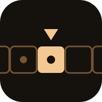

# Turing

[](https://github.com/nulljosh/turing/releases)
[](https://github.com/nulljosh/turing/actions/workflows/test.yml)
 [](https://github.com/nulljosh/turing)

Build small language models on one Mac. Samantha is a 0.5B model fine-tuned on your own writing, runs entirely on-device via MLX, and has 77 tools to act on the world.

[turing.heyitsmejosh.com](https://turing.heyitsmejosh.com)

## Features

- **77 tools.** Her Mac (open apps and sites, search, read a page, screenshot, clipboard, volume, battery, music, timers, notes, reminders, calendar, weather), pictures (paint any photo, make a logo, remove a background, upscale, enhance, rotate, crop, convert), and 47 small utilities that need no app: math, unit conversion, time in any city, dice, passwords, hashes, base64, morse, this Mac's disk, memory and Wi-Fi, any Apple Shortcut you name, and your Chrome tabs (list, switch, close, read the rendered page), she can read your PDFs and documents, find passages and answer questions about them or about your screen (grounded: a made-up number or name is declined), she can read what is on your screen (macOS Vision OCR, asks first), and a memory that survives across sessions ("remember that my dog is called Biscuit")
- **Draw anything on the landing page.** Type "draw a fox in the snow" and an image model on Cloudflare imagines it while she rebuilds the picture from 30,000 squares in front of you. The hero line above narrates what she is doing
- **Her own logo.** The icon above was designed by her. Her model steers four dials (palette, cell count, shape, how many cells glow), the harness lays the cells on a golden-angle spiral, and there is no text in it. Every logo she makes is an icon with no text: a golden spiral by default, or say complex or simple; the spec is in `pixelmator/examples/turing-bloom.json`
- **A harness.** `harness.py` keeps the conversation, prints every tool call before it runs, and asks before anything that writes or sends (a note, a reminder, a file, a Shortcut, the clipboard)
- **MCP both ways.** `mcp_server.py` lets Claude Code or any other assistant use her tools, and she can call other MCP servers from `~/.samantha/mcp.json` (she asks first)
- **Small enough to train at home** (Qwen2.5-0.5B LoRA on Apple Silicon via MLX, ~3.5GB memory)
- **No hallucination** (retrieves real facts from brain RAG, FAQ matching, live officeholder lookup)
- **Voices like you** (trained on your own docs and commit history, not generic web text)
- **Paint from photos.** Pick an image and it is rebuilt from tens of thousands of colored squares. No model draws it, a quadtree does. ImageMagick draws 40,000 squares in about a second; Pixelmator builds the same plan as real layers you can watch
- **Menu bar app** (PaintBar picks photos and shows progress without opening Pixelmator)
- **Tested end-to-end.** `./gate.sh` runs the chat, action, router-parity, Pixelmator and tool checks against a baseline that only moves up. Every function and class is documented, and CI fails below 100 percent

## Run it

```bash
./.venv/bin/python chat.py            # talk to Samantha
./.venv/bin/python ask.py "question"  # retrieve and answer
./.venv/bin/python harness.py          # a chat that asks before it writes
python3 mcp_server.py                  # her tools over MCP (claude mcp add samantha -- python3 mcp_server.py)
./pixelmator/pxm.py paint photo.jpg --out out.png --engine magick --shapes 40000 --detail 1024 --size 2048
./menubar/build.sh                     # build PaintBar (macOS menu bar app)
./gate.sh                             # every check, docs coverage first
./release.sh 0.12.0 "what shipped"     # cut a release
```

## How she is tested

- `eval/hands.py` - her own picker on phrasings it never saw
- `eval/actions.py` and `eval/web_parity.py` - the router, and its JavaScript twin on the landing page
- `eval/util_diff.py` - the utility tools, Python against JavaScript, word for word
- `test_harness.py` and `test_mcp.py` - the harness asks first, the MCP server answers a real client
- `eval/score.py` - knowledge (retrieval + generation on held-out set)
- `test_chat.py` - chat logic (history, scaffolds)
- pixelmator/test_pxm.py - painting (pixel order, orientation, tiling)

## Limits

- Her own picker knows the first 30 tools. The other 33 work through the exact router, not a model. Retraining it on all 63 is next
- On unseen phrasings the picker got 394 of 501, and the guard `_sound()` lets 9 wrong picks past and refuses no right ones
- The 10 tools that read this Mac (disk, memory, Wi-Fi, Shortcuts...) answer on a Mac only; the landing page's stand-in says so
- Calling another MCP server is explicit (`call mcp <server> <tool> {json}`) and asks first; her model never chooses it
- Multi-step asks borrow a 1.7B model via Ollama (training her own picker is the open roadmap)
- `eval/web_demo.py` needs the live site's /api, so it only fully passes against production


## More

- [`WHITEPAPER.md`](WHITEPAPER.md) - architecture and voice
- [`roadmap.md`](roadmap.md) - the honest phase-by-phase plan
- [`architecture.svg`](architecture.svg) - how the pieces fit together
